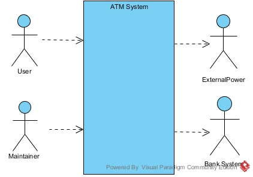
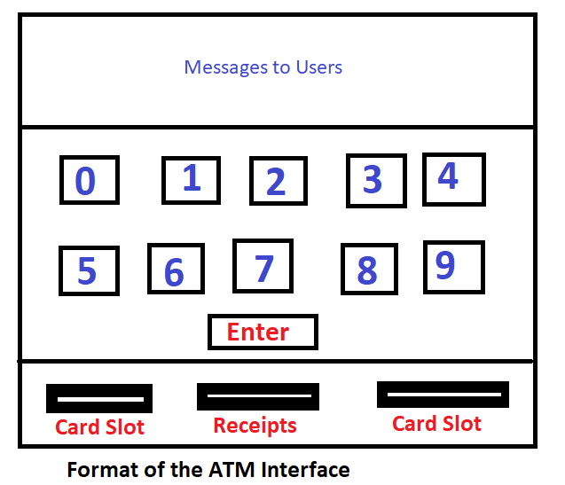

# Group Project- ATM

## Lets finish this project step by step with timeline

First I want write everything in word file which is explanation or details of the diagram.

Cant we draw UML Diagram using Visual_Paradigm?

1. System analysis: study, understand, and define requirements for the system (model of the system's functional requirements) 
2. Defining the boundaries of the problem 
3. Use-case model 
4. Deployment view 
5. Sequence diagram and operation
6. Design to code (UML design diagram)

This is our final group project of Object Oriented Programming and Analysis subject. Our project is to build a bank ATM software system. In this document we will try to explain the requirements and functionality of the ATM system. In another word, we will analyse the system and try to make you to understand how we build the system and how it works for banks. It is obvious that ATM is part of bank so we will show the whole picture of Banking system but we will only focus on ATM system. Ofcause bank can operate without ATM but ATM is positive impact on bank and their income. Also, ATM will make easy for customers to make money transections. 

# 1. Introduction
Under indroduction we will explain the following areas. 
- Main Purpose of the project.
- Scope of the project
- Overview of whole system
- Definition of some of the important words we used in this documents and the system.

## 1.1 Purpose
This document mainly decribes the software requriements and functionality of the ATM machine. And we will build the software system for ATM. It is intended for the designer developer and maintainer of the ATM. Also if any bank which dont have ATM services we might be able to sell the software or work for them to build a ATM system. 

Example of how customers use this system

## 1.2 Scope
The function of the ATM is to support a computerized banking network.

## 1.3 Overview
The remainder of this document is organized as follows. There will be some definitions of important terms. Section 2 contains a general description of the ATM. Section 3 identies the specic functional requirements the external interfaces and performance requirements of the ATM.

## 1.4 Definitions
- ATM : An Automatic Teller Machine (ATM) is a computer based machine, connected to a network, that offers, as basic functions to users, access to bank account (balance, bank transfers) and retrieval of money.

- Cash Card : A card assigned to a bank customer that authorizes access to accounts using an ATM machine Each card contains a bank code and a card numbers, coded in accordance with national standards on credit cards and cash cards The bank code uniquely identities the bank within the consortium The card number determines the accounts that the card can access A card does not necessarily access all of a customer's accounts Each cash card is owned by a single customer, but multiple copies of it may exist, so the possibility of simultaneous use of the same card from different machines must be considered.

- Bank : An establishment authorized by a government to accept deposits, pay interest, clear checks, make loans, act as an intermediary in financial transactions, and provide other financial services to its customers.

- Bank computer : The computer owned by a bank that interfaces with the ATM network and the bank's own cashier stations. A bank may actually have its own internal network of computers to process accounts, but we are only concerned with the one that interacts with the network.

- Account: A single account in a bank against which transactions can be applied. Accounts may be of various types with at least checking and savings. A customer can hold more than one account.

- Customer: The holder of one or more accounts in a bank. A customer can consist of one or more persons or corporations, the correspondence is not relevant to this problem. The same person holding an account at a different bank is considered a different customer

- Transaction : (TB) can be defined as the set of instruments and services that a bank offers to trading partners to financially support their reciprocal exchanges of goods (e.g.trade), monetary flows (e.g., cash), or commercial papers (e.g., exchanges)

# 2. General Description

## 2.1 Product Perspective
The ATM network doesn't work independentlyIt has to work together with the computers software owned by banks. There are clearly defined interfaces for the different systems

## 2.2 Product Functions
The software should support a computerized banking network Each bank provides its own computer to maintain its own accounts and process transactions against them. Automatic teller machines communicate with the banks, computers. An automatic teller machine accepts a cash cards interacts with the users communicates with the bank computer to carry out the transactions dispenses cash and prints receipts. The system requires appropriate record keeping and security provisions. The system must handle concurrent access to the same account correctly. The banks will provide their own software for their own computers. The cost of the shared system will be apportioned to the banks according go the number of customers with cash cards.

## 2.3 User Characteristics
- Customer
  The customer interacts with the ATM network via the ATM. It must be very easy for
  them to use the ATM. They should be supported by the system in every possible way.

- Maintainer(IT Technician from Bank)
  It should be easy to maintain the whole system. The maintainer should be the only
  person that is allowed to connect a new ATM to the network.

# 3. Specic Requirements

## 3.1 Functional Requirements
The functional requirements are organized in two sections
- First requirements of the ATM
- Second requirements of the bank
## 3.1.1 Requirements of the ATM
The requirements for the ATM are organized in the following way: General requirements, requirements for authorization, requirements for a transaction.

## General
## Functional requirement 1
- Description
  Initialize parameters t,k,m,n.  (t = Total fund in the ATM at start of day, k = Maximum withdrawal per day and account, m = mMximum withdrawal per transaction, n = Minimum cash in the ATM to permit a transaction)

- Input
  ATM is initialized with t dollars k,m,n are entered.

- Processing
  Storing the parameters.

- Output
  Parameters are set.

## Functional requirement 2
- Description
  If no cash card is in the ATM, the system should display initial display.

## Functional requirement 3
- Description
  If ATM is running out of money, no card should be accepted. An error message is displayed.

- Input
  A card is entered.

- Processing
  The amount of cash is less than total fund in the ATM at start of day.

- Output
  Display an error message Return cash card.

## Authorization
The authorization starts after a customer has entered his card in the ATM

# 4.Defining the Boundaries of the Problem

## 4.1 The hardware on which our software must execute

- The processor (like CPU)  in the ATM device.
- Time and date are supplied by a clock.
- User input is provided through a keypad.
- The screen of the ATM will show user the interface

## 4.2 Defining the context 

For this system, User and Maintainer are dependent on the ATM for its services as they use its navigation information, operate it, and maintain it, respectively. On the other hand,  the power services of the ATM will be provided by an external system, the External Power actor. Meanwhile, the information of accounts of users are provided by bank system. So, the ATM system should communicate with it.

## 4.3 Scenarios

Now, let's walk through several scenarios of doing some operates on the ATM.

1. First, a user should insert a cash card into the ATM. After it, the user should finish each step with 60 seconds. otherwise, the ATM will swallow the card.
2. Second, the system will show a interface that let the user to enter the password. And there are three options: correction, confirm, Take the card. If the user find that he entered wrong password, then he can choose the correction option, and he can enter the password again. Then, he(she) should choose the confirm option, and the ATM system will communicate with the bank system as well as check whether the password entered is right. if it's not correct, it will show the wrong information and user should enter password again. However, if the user can just entered the wrong password three times, the card will be frozen. 
3. After the user entered the right password, the interface will show some options(such changing password, Transfer money, Inquiry, withdrawal, deposit, take the card).
4. If the user choose the option of changing password, then the system will ask the user to enter the original password. after the user entered the correct password, then the user can enter the new password to change the old password.
5. If the user choose the option of Transfer money, then the system will first show some prompts. And after the user confirmed, then he(she) can enter the account that he(she) want to transfer money to. At last, he(she) should enter the amount of money he(she) want to transfer and confirm.
6. If the user choose the option of Inquiry, then the system will show two options, the first one is detailed inquiry, the second one is balance inquiry. If the user choose the first one, then it will show the recent ten transactions details. If the user choose the second one, it will show balance of the account and the balance that can be used.
7. If the user choose the option of withdrawal, it will show a interface that let the user to enter the amount of money he(she) want to withdraw. and after the user entered the number and confirmed, the  ATM will send the money to the user. However, if the amount entered by the user exceeds the balance in the card, then it show a message to tell the user. And then the user should enter a appropriate amount and confirm. At last, the system will show a show a successful transaction message(includes the amount of the transaction and the fee).
8. If the user choose the option of deposit, then it open the cover, and show a message to let the user to put the money into the ATM. If there are no faults, then it will show some successful information to the user.
9. If the user choose the option of take the card, then he can retrieve his(her) card and end the transaction.

## Functional requirement 4
- Description :
The ATM has to check if the entered card is a valid cash-card.

- Input :
Customer enters the cash card.

- Processing :
Check if it is a valid cash card. It will be valid if
1) the information on the card can be read.
2) it is not expired.

- Output :
Display error message and return cash card if it is invalid.

## Functional requirement 5
- Description :
If the cash card is valid, the ATM should read the serial number and bank code.

- Input :
Valid cash card.

- Processing :
Read the serial number.

- Output :
Initiate authorization dialog.

## Functional requirement 6
- Description :
The serial number should be logged.

- Input :
Serial number from cash card

- Processing :
Log the number

- Output :
Update to log file.

## Functional requirement 7
- Description :
Authorization dialog : 
The user is requested to enter his password. The ATM verifies the bank code and password with the bank computer

- Input :
Password from user, bank code from cash card.

- Processing: 
Send serial number and password to bank computer, receive response from bank.

- Output: 
Accept or reject authorization from bank.

## Functional requirement 8
- Description :
Different negative answers from bank computer for authorization dialog.

- Input :
Response from bank or authorization dialog :  

   + "bad password" if the password was wrong,
   + "bad bank code" if the cash card of the bank is not supported by the ATM,
   + "bad account" if there are problems with the account.

- Processing :If the ATM gets any of these messages from the bank computer, the card will be ejected and the user will get the relevant error message.

- Output :
Card is ejected and error message is displayed.

## Functional requirement 9
- Description :
If password and serial number are ok, the authorization process is finished

- Input :
The ATM gets accept from the bank computer from authorization process

- Processing :
Finishing authorization

- Output :
Start transaction dialog

## Functional requirement 10
- Description :
If a card was entered more than three times in a row at any ATM and the password was wrong each time, the card is kept by the ATM. A message will be displayed that the customer should call the bank.

- Input :
Entering a wrong password for the fourth time in succession

- Processing :
Initiate authorization process. Response from bank computer is to keep the card

- Output : Display error message that the customer should call the bank.

## Functions
These are the requirements for the different functions the ATM should provide after authorization.

## Functional requirement 11
- Description :
The kind of transactions the ATM offers is: withdrawal

- Input :
Authorization successfully completed. Enter the amount to withdraw.

- Processing :
Amount entered is compared with m ( m = Maximum withdrawal per transaction)

- Output : Amount of money to be dispensed is displayed. Begin initial withdrawal sequence.

## Functional requirement 12
- Description :  
Initial withdrawal sequence : If it is too much withdrawal redo the transaction.

- Input :
Customer has entered the amount of money

- Processing :
Error if the amount is greater than m (m = Maximum withdrawal per transaction)

- Output : Start transaction or re-initiate transaction dialog if the amount is not within the pre-defined transaction policy.

## Functional requirement 13
- Description :  
Perform transaction

- Input :
Initial withdrawal sequence successful

- Processing :
Send request to the bank computer.

- Output : Wait for response from the bank computer.

## Functional requirement 14
- Description :  
If the transaction is successful, the money is dispensed.

- Input :
ATM gets message "transaction succeeded" from the bank computer.

- Processing :
ATM prints receipt, updates Total fund in the ATM at start of day and ejects the card. Dialog
Customer should take the card.

- Output : After the Customer has taken the card the money is dispensed.

## Functional requirement 15
- Description :  
If the money is dispensed, the amount is logged

- Input :
The number of 20 yuan bills requested is dispensed to the customer.

- Processing :
Log the amount of money against the serial number of the card.

- Output : 
Amount logged together with the serial number. Response sent to bank for money dispensed.

## Functional requirement 16
- Description :  
If the transaction is not successful, an error message should be displayed. The card should be ejected.

- Input :
ATM gets message "transaction not successful" from the bank computer.

- Processing :  
ATM displays error message, Dialog : 
"Customer should take the card"

- Output : 
Eject card.

## 3.1.2 Requirements of the bank computer for the ATM

### Authorization 
The bank computer gets a request from the ATM to verify an account.
 
## Functional requirement 1
- Description :  
The bank computer checks if the the bank code is valid. A bank code is valid if the cash card was issued by the bank.

- Input :
Request from the ATM to verify card Serial number and password.

- Processing :
Check if the cash card was issued by the bank.

- Output : 
Valid or invalid bank code.

## Functional requirement 2
- Description :  
If it is not a valid bank code, the bank computer will send a message to the ATM.

- Input :
Invalid bank code

- Processing :
Process message

- Output : 
The bank computer sends the message "bad bank code" to the ATM.

## Functional requirement 3
- Description :  
The bank computer checks if the the password is valid for a valid cash card.

- Input :
Request from the ATM to verify password

- Processing :
Check password of the customer.

- Output : 
Valid or invalid password

## Functional requirement 4
- Description :  
If it is not a valid password, the bank computer will send a message to the ATM

- Input :
Invalid password

- Processing :
Process message, Update count for in valid password for the account.

- Output : 
The bank computer sends the message "bad password" to the ATM.

## Functional requirement 5
- Description :  
If it is a valid cash card and a valid password but there are problems with the account, the bank will send a message to the ATM that there are problems

- Input :
Valid cash card and password

- Processing :
Process message

- Output : 
The bank sends "bad account" to the ATM.

## Functional requirement 6
- Description :  
If it is a valid cash card, a valid password and there are no problems with the account the bank computer will send a message to the ATM that everything is ok

- Input :
Valid cash card, password and account

- Processing :
Process message

- Output : 
Send "account ok" to the ATM.

### Transaction
The bank computer gets a request to process a transaction from the ATM.

## Functional requirement 7
- Description :  
After a request the bank computer processes the transaction.

- Input :
Request to process a transaction on an account and amount m to withdraw.

- Processing :
Process transaction ( together with the software of the bank). Update k for amount (k = Maximum withdrawal per day and account)

- Output : 
If transaction succeeded, the bank computer sends the message "transaction succeeded" to the ATM. If not, it will send "transaction failed".

## Functional requirement 8
- Description :  
Update account after money is dispensed

- Input :
Response from ATM about money dispensed.

- Processing :
Updates account

- Output : 
New account record

## Functional requirement 9
- Description :  
Each bank has a limit k for each account about the amount of money that is a vailable via cash card each day/monthly

- Input :
Request to process transaction.

- Processing :
Check if the amount of money doesn't exceed k (k = Maximum withdrawal per day and account)

- Output : 
If the amount exceeds the limit, the transaction will fail.

## Functional requirement 10
The bank only provides security for their own computer and their own software.

## 3.2 External Interface Requirement
### 3.2.1 User Interfaces

The interface of the ATM must fulfill ergonomic requirements. The following is just an example for a possible interface to the ATM

### 3.2.2 Hardware Interfaces
The ATM network has to provide hardware interfaces to: 
- various printers
- various ATM machines :  
There are several companies producing the ATM machines.
- several types of networks The exact specifcation of the hardware interfaces is not part of this document

### 3.2.3 Software Interfaces
The ATM network has to provide software interfaces to: 
- the software used by different banks
- different network softwar  
The exact, detailed specifcation of the software interfaces is not part of this document.

### 3.2.4 Communication Interfaces
There is no restriction of the ATM network to a specific network protocol as long as the performance requirements are satisfied.

## 3.3 Performance Requirements
### Performance requirement 1
- Description  
Error message should be displayed at least 30 sec.

### Performance requirement 2
- Description  
If there is no response from the bank computer after a request within 2 minutes the card is rejected with an error message

### Performance requirement 3
- Description  
The ATM dispenses money if and only if the withdrawal from the account is processed and accepted by the bank.

### Performance requirement 4
- Description  
Each bank may be processing transactions from several ATMs at the same time.

## 3.4 Attributes
### 3.4.1 Availability
The ATM network has to be available 24 hours a day.

### 3.4.2 Security
The ATM network should provide maximal security. In order to make that much more transparent there are the following requirements  
+ It must be impossible to plug into the network

### 3.4.3 Maintainability
Only maintainers are allowed to connect new ATM's to the network. (Maintainer)

### 3.4.4 Transferability/Conversions
Not Applicable for now

## 3.5 Other Requirements
### 3.5.1 Data Base
The ATM must be able to use several data formats according to the data formats that are provided by the data bases of different banks. A transaction should have all the properties of a data base transaction (Atomicity, Consistency, Isolation, Durability).
